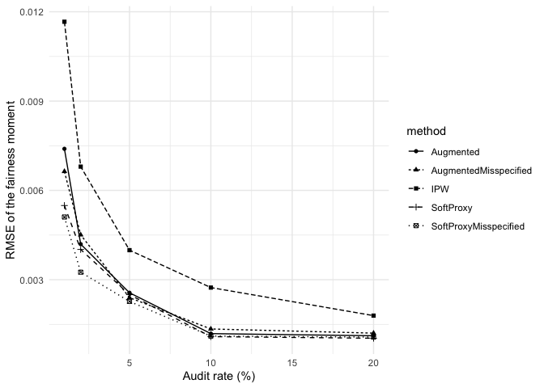
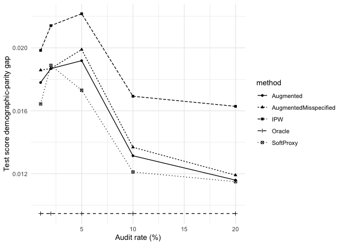
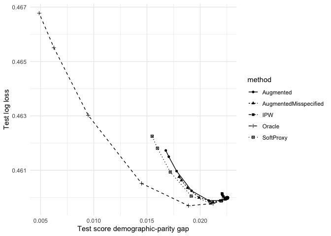

# Audit-Certified Fair GLMs with Partially Observed Demographics


- [1. Source/target proxy-provenance
  simulation](#1-sourcetarget-proxy-provenance-simulation)
- [2. Smoke test](#2-smoke-test)
- [3. UCI Credit Default application](#3-uci-credit-default-application)
  - [Fixed-score fairness-moment
    estimation](#fixed-score-fairness-moment-estimation)
  - [Fair-GLM learning](#fair-glm-learning)
- [4. Appendix robustness
  experiments](#4-appendix-robustness-experiments)
  - [Proxy quality versus efficiency](#proxy-quality-versus-efficiency)
  - [Analytic design-variance
    validation](#analytic-design-variance-validation)
  - [Exact score penalty versus convex
    surrogate](#exact-score-penalty-versus-convex-surrogate)
  - [Neyman allocation with an external
    pilot](#neyman-allocation-with-an-external-pilot)
  - [Two-phase Neyman allocation under a counted total
    budget](#two-phase-neyman-allocation-under-a-counted-total-budget)
  - [Penalty-selection robustness](#penalty-selection-robustness)
- [5. Generated manuscript artifacts](#5-generated-manuscript-artifacts)
- [6. Software environment](#6-software-environment)

This notebook is the single entry point for the numerical analysis in
the paper. Rendering it with Quarto produces `reproduce.md` rather than
HTML.

It sources only three R files:

- `R/01_core.R`: estimators, GLM solvers, audit and allocation
  utilities;
- `R/02_data.R`: UCI Credit data preparation;
- `R/03_experiments.R`: simulation, empirical experiments, and figures.

The default `quick: true` configuration is intended as a reproducibility
check. Use `quick: false` for the manuscript Monte Carlo sizes.

``` r
required <- c("readxl", "ggplot2")
missing <- required[
  !vapply(required, requireNamespace, logical(1), quietly = TRUE)
]
if (length(missing)) {
  stop(
    "Install the missing package(s): ",
    paste(missing, collapse = ", ")
  )
}

source("R/01_core.R")
source("R/02_data.R")
source("R/03_experiments.R")

dir.create("data", showWarnings = FALSE)
dir.create("results", showWarnings = FALSE)
dir.create("figures", showWarnings = FALSE)

cat("Core version:", PROXY_FAIR_GLM_CORE_VERSION, "\n")
```

    Core version: 5.1 

``` r
cat("Quick mode:", params$quick, "\n")
```

    Quick mode: TRUE 

# 1. Source/target proxy-provenance simulation

This is the original simulation used for the source/target
proxy-provenance experiment. The full configuration uses 120,000 source
observations, 30,000 target observations, 500 repeated audits per
scenario/rate cell, audit rates 1%, 2%, 5%, 10%, and 20%, and three
target regimes: transported, prior shift, and feature shift.

The compared auxiliary demographic models are target-audit, external
same-X, a deliberately distorted external score, its audit-recalibrated
version, and a BISG-like surname/geography score.

``` r
if (params$run_provenance) {
  provenance <- run_proxy_provenance(
    root = ".",
    quick = params$quick,
    figures_dir = "figures"
  )
  provenance$summary[
    provenance$summary$audit_rate == 0.05 &
      provenance$summary$method %in% c(
        "IPW",
        "Augmented: Target-audit",
        "Augmented: External",
        "Augmented: External recalibrated",
        "Augmented: External BISG-like"
      ),
    c("scenario", "method", "bias", "sd", "rmse", "mean_brier", "mean_auc")
  ]
}
```

    SAME-X PROXY PROVENANCE DIAGNOSTIC
    ==================================

    N_source = 30000; N_target = 8000; repeated audits per cell = 100

    Scenario: transported
      1% RMSE -- IPW: 0.01737; target: 0.00834; external same-X: 0.00753; recalibrated: 0.00776; BISG-like: 0.00925
     20% RMSE -- IPW: 0.00303; target: 0.00151; external same-X: 0.00151; recalibrated: 0.00151; BISG-like: 0.00174
      5% plug-in bias -- external same-X: -0.00046; distorted: 0.00957; recalibrated: -0.00047; BISG-like: -0.02592

    Scenario: prior_shift
      1% RMSE -- IPW: 0.01705; target: 0.00773; external same-X: 0.00765; recalibrated: 0.00727; BISG-like: 0.01027
     20% RMSE -- IPW: 0.00332; target: 0.00145; external same-X: 0.00142; recalibrated: 0.00145; BISG-like: 0.00172
      5% plug-in bias -- external same-X: -0.00370; distorted: 0.00602; recalibrated: -0.00030; BISG-like: -0.03158

    Scenario: feature_shift
      1% RMSE -- IPW: 0.01270; target: 0.00793; external same-X: 0.00991; recalibrated: 0.01057; BISG-like: 0.00781
     20% RMSE -- IPW: 0.00300; target: 0.00200; external same-X: 0.00219; recalibrated: 0.00215; BISG-like: 0.00195
      5% plug-in bias -- external same-X: 0.02784; distorted: 0.03569; recalibrated: 0.02611; BISG-like: 0.00695
     

                                                          scenario
    feature_shift.0.05.Augmented: External BISG-like feature_shift
    prior_shift.0.05.Augmented: External BISG-like     prior_shift
    transported.0.05.Augmented: External BISG-like     transported
    feature_shift.0.05.IPW                           feature_shift
    prior_shift.0.05.IPW                               prior_shift
    transported.0.05.IPW                               transported
                                                                            method
    feature_shift.0.05.Augmented: External BISG-like Augmented: External BISG-like
    prior_shift.0.05.Augmented: External BISG-like   Augmented: External BISG-like
    transported.0.05.Augmented: External BISG-like   Augmented: External BISG-like
    feature_shift.0.05.IPW                                                     IPW
    prior_shift.0.05.IPW                                                       IPW
    transported.0.05.IPW                                                       IPW
                                                              bias          sd
    feature_shift.0.05.Augmented: External BISG-like  9.224816e-04 0.003784367
    prior_shift.0.05.Augmented: External BISG-like    5.697438e-05 0.004178398
    transported.0.05.Augmented: External BISG-like   -3.340130e-04 0.004393294
    feature_shift.0.05.IPW                            8.909548e-04 0.005935162
    prior_shift.0.05.IPW                             -2.411962e-04 0.008628030
    transported.0.05.IPW                             -1.475366e-03 0.007530599
                                                            rmse mean_brier
    feature_shift.0.05.Augmented: External BISG-like 0.003876750  0.1533075
    prior_shift.0.05.Augmented: External BISG-like   0.004157844  0.1517167
    transported.0.05.Augmented: External BISG-like   0.004384015  0.1261551
    feature_shift.0.05.IPW                           0.005972243         NA
    prior_shift.0.05.IPW                             0.008588169         NA
    transported.0.05.IPW                             0.007636722         NA
                                                      mean_auc
    feature_shift.0.05.Augmented: External BISG-like 0.8625408
    prior_shift.0.05.Augmented: External BISG-like   0.8627397
    transported.0.05.Augmented: External BISG-like   0.8642927
    feature_shift.0.05.IPW                                  NA
    prior_shift.0.05.IPW                                    NA
    transported.0.05.IPW                                    NA

The simulation writes its CSV outputs and six publication figures to
`simulation/`, and copies the PDF figures to `figures/`.

# 2. Smoke test

``` r
smoke <- run_smoke_simulation()
smoke
```

      estimator     moment
    1     Truth 0.03216251
    2   Plug-in 0.02653544
    3       IPW 0.03645963
    4 Augmented 0.02774269

# 3. UCI Credit Default application

The data are downloaded automatically from the UCI repository on the
first run. The paper uses a fixed 60/20/20 split stratified by `(Y,S)`,
five-fold honest cross-fitting, audit rates 1–20%, 300 audit draws for
fixed-score moment estimation, 40 learning repetitions, and the exact
probability-score fairness path.

``` r
if (params$run_credit) {
  cfg <- credit_config(
    quick = params$quick,
    sensitive = params$sensitive,
    path_type = params$path_type
  )

  credit <- run_credit_main(
    root = ".",
    config = cfg,
    save_results = TRUE
  )

  main_figure_files <- save_main_manuscript_figures(
    credit,
    figures_dir = "figures",
    sensitive = params$sensitive
  )
}
```

## Fixed-score fairness-moment estimation

``` r
if (params$run_credit) {
  moment_table <- subset(
    credit$moment_summary,
    method %in% c(
      "SoftProxy", "IPW", "Augmented",
      "SoftProxyMisspecified", "AugmentedMisspecified"
    )
  )
  moment_table[
    order(moment_table$audit_rate, moment_table$method),
    c("audit_rate", "method", "error_mean", "rmse", "n_rep")
  ]
}
```

                               audit_rate                method    error_mean
    0.01.Augmented                   0.01             Augmented  1.492572e-03
    0.01.AugmentedMisspecified       0.01 AugmentedMisspecified  2.456586e-03
    0.01.IPW                         0.01                   IPW  2.277551e-03
    0.01.SoftProxy                   0.01             SoftProxy  6.670022e-04
    0.01.SoftProxyMisspecified       0.01 SoftProxyMisspecified  1.169474e-03
    0.02.Augmented                   0.02             Augmented -5.881304e-04
    0.02.AugmentedMisspecified       0.02 AugmentedMisspecified -6.668766e-04
    0.02.IPW                         0.02                   IPW  1.008649e-04
    0.02.SoftProxy                   0.02             SoftProxy -7.305075e-04
    0.02.SoftProxyMisspecified       0.02 SoftProxyMisspecified -4.716244e-04
    0.05.Augmented                   0.05             Augmented  6.794176e-04
    0.05.AugmentedMisspecified       0.05 AugmentedMisspecified  5.691419e-04
    0.05.IPW                         0.05                   IPW  7.784017e-04
    0.05.SoftProxy                   0.05             SoftProxy  5.381235e-04
    0.05.SoftProxyMisspecified       0.05 SoftProxyMisspecified  3.244554e-04
    0.1.Augmented                    0.10             Augmented  4.083955e-04
    0.1.AugmentedMisspecified        0.10 AugmentedMisspecified  6.393250e-04
    0.1.IPW                          0.10                   IPW  5.187193e-04
    0.1.SoftProxy                    0.10             SoftProxy  2.666182e-04
    0.1.SoftProxyMisspecified        0.10 SoftProxyMisspecified  1.707313e-04
    0.2.Augmented                    0.20             Augmented  5.668761e-05
    0.2.AugmentedMisspecified        0.20 AugmentedMisspecified -6.345984e-06
    0.2.IPW                          0.20                   IPW  5.994623e-04
    0.2.SoftProxy                    0.20             SoftProxy -8.860306e-06
    0.2.SoftProxyMisspecified        0.20 SoftProxyMisspecified -2.720092e-04
                                      rmse n_rep
    0.01.Augmented             0.007396779    20
    0.01.AugmentedMisspecified 0.006637238    20
    0.01.IPW                   0.011665180    20
    0.01.SoftProxy             0.005492234    20
    0.01.SoftProxyMisspecified 0.005106272    20
    0.02.Augmented             0.004194871    20
    0.02.AugmentedMisspecified 0.004507895    20
    0.02.IPW                   0.006798909    20
    0.02.SoftProxy             0.004016250    20
    0.02.SoftProxyMisspecified 0.003253658    20
    0.05.Augmented             0.002562129    20
    0.05.AugmentedMisspecified 0.002397578    20
    0.05.IPW                   0.003992843    20
    0.05.SoftProxy             0.002498825    20
    0.05.SoftProxyMisspecified 0.002270342    20
    0.1.Augmented              0.001190442    20
    0.1.AugmentedMisspecified  0.001345833    20
    0.1.IPW                    0.002736446    20
    0.1.SoftProxy              0.001089226    20
    0.1.SoftProxyMisspecified  0.001107312    20
    0.2.Augmented              0.001117622    20
    0.2.AugmentedMisspecified  0.001206039    20
    0.2.IPW                    0.001794200    20
    0.2.SoftProxy              0.001034632    20
    0.2.SoftProxyMisspecified  0.001072719    20

``` r
if (params$run_credit) {
  credit_plots <- plot_credit_main(credit)
  credit_plots$rmse
}
```



## Fair-GLM learning

The learning experiment uses a common empirical target for comparing
methods: the smallest penalty that reduces the estimated training
fairness moment by 50%. This is an efficiency comparison rather than the
simultaneous finite-sample certificate developed in the theory section.

``` r
if (params$run_credit) {
  selected_table <- stats::aggregate(
    cbind(log_loss, dp_score, eo_score, lambda) ~
      audit_rate + method,
    data = credit$learning,
    FUN = mean
  )
  selected_table[
    selected_table$method %in%
      c("Unconstrained", "Oracle", "SoftProxy", "IPW", "Augmented"),
  ]
}
```

       audit_rate        method  log_loss    dp_score    eo_score     lambda
    1        0.01     Augmented 0.4631532 0.017794595 0.011554914  100.00000
    2        0.02     Augmented 0.4607634 0.018678798 0.012102244  316.22777
    3        0.05     Augmented 0.4602452 0.019182857 0.012588904  316.22777
    4        0.10     Augmented 0.4625488 0.013143982 0.006731052  772.07592
    5        0.20     Augmented 0.4622251 0.011596687 0.005323056 1000.00000
    11       0.01           IPW 0.4610161 0.019835289 0.013188213   54.41518
    12       0.02           IPW 0.4601913 0.021408548 0.014639982  100.00000
    13       0.05           IPW 0.4600372 0.022165006 0.015369034  316.22777
    14       0.10           IPW 0.4610278 0.016922665 0.010227460  316.22777
    15       0.20           IPW 0.4606724 0.016281734 0.009737566  316.22777
    16       0.01        Oracle 0.4630232 0.009470837 0.003462869 1000.00000
    17       0.02        Oracle 0.4630232 0.009470837 0.003462869 1000.00000
    18       0.05        Oracle 0.4630232 0.009470837 0.003462869 1000.00000
    19       0.10        Oracle 0.4630232 0.009470837 0.003462869 1000.00000
    20       0.20        Oracle 0.4630232 0.009470837 0.003462869 1000.00000
    21       0.01     SoftProxy 0.4628188 0.016435580 0.010240059  244.15184
    22       0.02     SoftProxy 0.4601971 0.018884486 0.012160062  316.22777
    23       0.05     SoftProxy 0.4609041 0.017306018 0.010764458  772.07592
    24       0.10     SoftProxy 0.4630017 0.012114337 0.006027872  772.07592
    25       0.20     SoftProxy 0.4621093 0.011495209 0.005263535 1000.00000
    26       0.01 Unconstrained 0.4599852 0.022545004 0.015652070    0.00000
    27       0.02 Unconstrained 0.4599852 0.022545004 0.015652070    0.00000
    28       0.05 Unconstrained 0.4599852 0.022545004 0.015652070    0.00000
    29       0.10 Unconstrained 0.4599852 0.022545004 0.015652070    0.00000
    30       0.20 Unconstrained 0.4599852 0.022545004 0.015652070    0.00000

``` r
if (params$run_credit) {
  credit_plots$selected_dp
}
```



``` r
if (params$run_credit) {
  credit_plots$frontier
}
```



# 4. Appendix robustness experiments

These experiments are optional because the full Monte Carlo suite is
much more expensive. Enable them with `run_robustness: true`.

``` r
if (params$run_robustness) {
  stress <- run_proxy_stress(
    root = ".",
    quick = params$quick,
    sensitive = params$sensitive
  )

  variance_check <- run_variance_validation(
    root = ".",
    quick = params$quick,
    sensitive = params$sensitive
  )

  exact_convex <- run_exact_vs_convex(
    root = ".",
    quick = params$quick,
    sensitive = params$sensitive
  )

  neyman_external <- run_neyman_external_pilot(
    root = ".",
    quick = params$quick,
    sensitive = params$sensitive
  )

  neyman_total <- run_neyman_total_budget(
    root = ".",
    quick = params$quick,
    sensitive = params$sensitive
  )

  selection <- run_selection_robustness(
    root = ".",
    quick = params$quick,
    sensitive = params$sensitive
  )

  robustness_figure_files <- save_robustness_figures(
    stress = stress,
    variance_check = variance_check,
    exact_convex = exact_convex,
    neyman_external = neyman_external,
    neyman_total = neyman_total,
    selection = selection,
    figures_dir = "figures"
  )
}
```

## Proxy quality versus efficiency

``` r
if (params$run_robustness) {
  stress$variance[
    order(stress$variance$audit_rate, stress$variance$proxy_case),
  ]
}
```

## Analytic design-variance validation

``` r
if (params$run_robustness) {
  variance_check$summary
}
```

## Exact score penalty versus convex surrogate

``` r
if (params$run_robustness) {
  exact_convex$summary
}
```

## Neyman allocation with an external pilot

``` r
if (params$run_robustness) {
  neyman_external$summary
}
```

## Two-phase Neyman allocation under a counted total budget

``` r
if (params$run_robustness) {
  neyman_total$summary
}
```

## Penalty-selection robustness

``` r
if (params$run_robustness) {
  selection$summary
}
```

# 5. Generated manuscript artifacts

The main render writes numerical summaries to `results/`, the
source/target simulation outputs to `simulation/`, and manuscript
figures to `figures/`.

``` r
sort(list.files("figures"))
```

    [1] "credit_frontier_sex.pdf"                  
    [2] "credit_moment_rmse_sex.pdf"               
    [3] "credit_selected_dp_sex.pdf"               
    [4] "figure_sameX_calibration_plugin_bias.pdf" 
    [5] "figure_sameX_calibration_variance.pdf"    
    [6] "figure_sameX_external_proxy_bias.pdf"     
    [7] "figure_sameX_external_vs_target_ratio.pdf"
    [8] "figure_sameX_provenance_rmse.pdf"         
    [9] "figure_sameX_proxy_brier.pdf"             

# 6. Software environment

``` r
sessionInfo()
```

    R version 4.5.2 (2025-10-31)
    Platform: aarch64-apple-darwin20
    Running under: macOS Tahoe 26.5.1

    Matrix products: default
    BLAS:   /System/Library/Frameworks/Accelerate.framework/Versions/A/Frameworks/vecLib.framework/Versions/A/libBLAS.dylib 
    LAPACK: /Library/Frameworks/R.framework/Versions/4.5-arm64/Resources/lib/libRlapack.dylib;  LAPACK version 3.12.1

    locale:
    [1] en_US.UTF-8/en_US.UTF-8/en_US.UTF-8/C/en_US.UTF-8/en_US.UTF-8

    time zone: America/Toronto
    tzcode source: internal

    attached base packages:
    [1] stats     graphics  grDevices utils     datasets  methods   base     

    other attached packages:
    [1] ggplot2_4.0.3

    loaded via a namespace (and not attached):
     [1] vctrs_0.7.3        cli_3.6.6          knitr_1.50         rlang_1.2.0       
     [5] xfun_0.52          generics_0.1.4     textshaping_1.0.1  S7_0.2.2          
     [9] jsonlite_2.0.0     labeling_0.4.3     glue_1.8.0         htmltools_0.5.8.1 
    [13] ragg_1.4.0         readxl_1.5.0       scales_1.4.0       rmarkdown_2.29    
    [17] grid_4.5.2         cellranger_1.1.0   tibble_3.3.0       evaluate_1.0.4    
    [21] fastmap_1.2.0      yaml_2.3.10        lifecycle_1.0.5    compiler_4.5.2    
    [25] dplyr_1.2.1        RColorBrewer_1.1-3 pkgconfig_2.0.3    rstudioapi_0.18.0 
    [29] systemfonts_1.2.3  farver_2.1.2       digest_0.6.37      R6_2.6.1          
    [33] tidyselect_1.2.1   dichromat_2.0-0.1  pillar_1.11.0      magrittr_2.0.3    
    [37] withr_3.0.2        tools_4.5.2        gtable_0.3.6      
